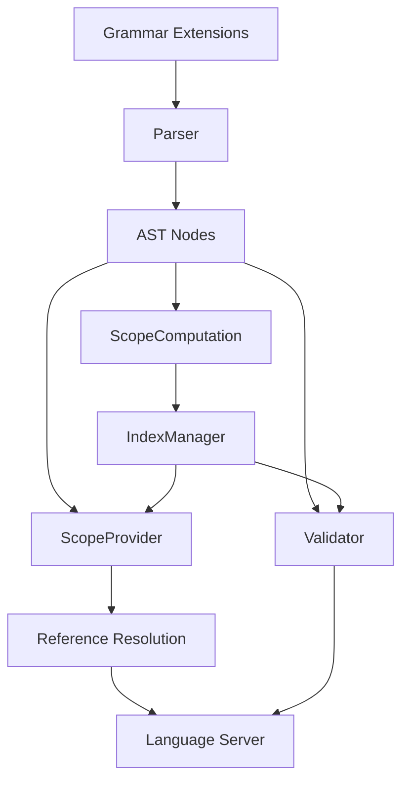

# Design Document: Cross-File Referencing in Auwgent DSL

## Overview

This design document describes the implementation of cross-file referencing capabilities for the Auwgent DSL. The feature enables modular agent development by allowing helpers, types, and prompts to be defined in separate files and imported where needed.

The implementation leverages Langium's built-in infrastructure for cross-document references, including the IndexManager for symbol tracking, ScopeProvider for reference resolution, and the Language Server Protocol for IDE features. The design follows Langium best practices and maintains backward compatibility with existing single-file agents.

### Key Design Principles

1. **Explicit Exports**: Only elements marked with `export` keyword are available for import
2. **Relative Path Resolution**: Import paths are resolved relative to the importing file
3. **Type Safety**: Cross-file type references maintain full type checking
4. **IDE Integration**: Full support for autocomplete, go-to-definition, find references, and rename refactoring
5. **Backward Compatibility**: Existing single-file agents work without modification
6. **Performance**: Efficient indexing and caching for large workspaces

## Architecture

### Component Overview

The cross-file referencing system consists of four main components:



1. **Grammar Extensions**: New grammar rules for import/export statements
2. **ScopeComputation**: Collects and publishes exported symbols to the global scope
3. **ScopeProvider**: Resolves references by querying imported symbols
4. **Validator**: Validates imports, exports, and detects circular dependencies

### File Structure

```
langium-project/
├── src/
│   ├── language/
│   │   ├── auwgent.langium          # Grammar definition (extended)
│   │   ├── auwgent-scope-provider.ts # Reference resolution
│   │   ├── auwgent-scope-computation.ts # Export collection
│   │   ├── auwgent-validator.ts     # Import/export validation
│   │   └── auwgent-uri-resolver.ts  # Path resolution
│   └── cli/
│       └── index.ts                  # CLI entry point
└── test/
    └── cross-file/                   # Cross-file test cases
```

## Components and Interfaces

### 1. Grammar Extensions

#### Import Statement Grammar

```langium
Import:
    'import' (NamedImports | WildcardImport) 'from' importPath=STRING;

NamedImports:
    '{' imports+=ImportSpecifier (',' imports+=ImportSpecifier)* '}';

ImportSpecifier:
    imported=[Exportable:ID] ('as' alias=ID)?;

WildcardImport:
    '*' 'as' namespace=ID;
```

#### Export Statement Grammar

```langium
// Modify existing rules to support export keyword
ExportableHelper:
    'export'? 'helper' name=ID '{' ... '}';

ExportableType:
    'export'? 'type' name=ID '{' ... '}';

ExportablePrompt:
    'export'? 'prompt' name=ID '{' ... '}';

// Union type for all exportable elements
Exportable = ExportableHelper | ExportableType | ExportablePrompt;
```

#### File Structure Grammar

```langium
AuwgentFile:
    imports+=Import*
    elements+=(Agent | ExportableHelper | ExportableType | ExportablePrompt)*;
```

### 2. AST Node Interfaces

```typescript
// Import AST nodes
interface Import extends AstNode {
    imports: ImportSpecifier[] | undefined;
    namespace: string | undefined;
    importPath: string;
}

interface ImportSpecifier extends AstNode {
    imported: Reference<Exportable>;
    alias: string | undefined;
}

// Exportable marker interface
interface Exportable extends AstNode {
    name: string;
    exported: boolean;
}

// Extended existing interfaces
interface Helper extends Exportable {
    exported: boolean;
    // ... existing fields
}

interface TypeDeclaration extends Exportable {
    exported: boolean;
    // ... existing fields
}

interface NamedPrompt extends Exportable {
    exported: boolean;
    // ... existing fields
}
```

### 3. URI Resolver

The URI resolver converts relative import paths to absolute URIs for file lookup.

```typescript
interface UriResolver {
    /**
     * Resolves a relative import path to an absolute URI
     * @param importPath - The path from the import statement
     * @param importingFileUri - The URI of the file containing the import
     * @returns The resolved absolute URI, or undefined if resolution fails
     */
    resolveImportUri(importPath: string, importingFileUri: URI): URI | undefined;
}

class AuwgentUriResolver implements UriResolver {
    resolveImportUri(importPath: string, importingFileUri: URI): URI | undefined {
        // Remove quotes from import path
        const cleanPath = importPath.replace(/['"]/g, '');
        
        // Add .agent extension if not present
        const pathWithExtension = cleanPath.endsWith('.agent') 
            ? cleanPath 
            : `${cleanPath}.agent`;
        
        // Resolve relative to importing file's directory
        const importingDir = Utils.dirname(importingFileUri);
        const resolvedUri = Utils.resolvePath(importingDir, pathWithExtension);
        
        return resolvedUri;
    }
}
```

### 4. Scope Computation

The scope computation service identifies which symbols should be exported to the global scope.

```typescript
class AuwgentScopeComputation extends DefaultScopeComputation {
    /**
     * Collects exported symbols from a document for the global scope
     */
    async computeExports(document: LangiumDocument): Promise<AstNodeDescription[]> {
        const exportedDescriptions: AstNodeDescription[] = [];
        const model = document.parseResult.value as AuwgentFile;
        
        // Collect all exportable elements
        for (const element of model.elements) {
            if (this.isExportable(element) && element.exported) {
                const description = this.descriptions.createDescription(
                    element,
                    element.name,
                    document
                );
                exportedDescriptions.push(description);
            }
        }
        
        return exportedDescriptions;
    }
    
    private isExportable(element: AstNode): element is Exportable {
        return isHelper(element) || isTypeDeclaration(element) || isNamedPrompt(element);
    }
}
```

### 5. Scope Provider

The scope provider resolves references by querying imported symbols.

```typescript
class AuwgentScopeProvider extends DefaultScopeProvider {
    private uriResolver: UriResolver;
    
    override getScope(context: ReferenceInfo): Scope {
        const referenceType = this.reflection.getReferenceType(context);
        
        // Handle references to importable symbols
        if (this.isImportableType(referenceType)) {
            return this.getImportedScope(context);
        }
        
        // Fall back to default scope resolution
        return super.getScope(context);
    }
    
    private getImportedScope(context: ReferenceInfo): Scope {
        const document = getDocument(context.container);
        const model = document.parseResult.value as AuwgentFile;
        
        // Collect local scope (current file)
        const localScope = this.getLocalScope(model, context);
        
        // Collect imported scope
        const importedDescriptions: AstNodeDescription[] = [];
        
        for (const importStmt of model.imports) {
            const targetUri = this.uriResolver.resolveImportUri(
                importStmt.importPath,
                document.uri
            );
            
            if (!targetUri) continue;
            
            if (importStmt.namespace) {
                // Wildcard import: add qualified names
                const exports = this.indexManager.allElements(
                    this.getExportableType(context),
                    new Set([targetUri])
                );
                
                for (const exp of exports) {
                    const qualifiedName = `${importStmt.namespace}.${exp.name}`;
                    importedDescriptions.push({
                        ...exp,
                        name: qualifiedName
                    });
                }
            } else if (importStmt.imports) {
                // Named imports: add with original or aliased names
                for (const spec of importStmt.imports) {
                    const symbolName = spec.imported.$refText;
                    const localName = spec.alias || symbolName;
                    
                    const exports = this.indexManager.allElements(
                        this.getExportableType(context),
                        new Set([targetUri])
                    );
                    
                    const matchingExport = exports.find(e => e.name === symbolName);
                    if (matchingExport) {
                        importedDescriptions.push({
                            ...matchingExport,
                            name: localName
                        });
                    }
                }
            }
        }
        
        // Combine local and imported scopes (local takes precedence)
        return this.createScope(importedDescriptions, localScope);
    }
    
    private isImportableType(referenceType: string): boolean {
        return referenceType === 'Helper' || 
               referenceType === 'TypeDeclaration' || 
               referenceType === 'NamedPrompt';
    }
}
```

### 6. Validator

The validator checks import/export correctness and detects circular dependencies.

```typescript
class AuwgentValidator {
    /**
     * Validates import statements
     */
    @ValidationCheck
    checkImports(importStmt: Import, accept: ValidationAcceptor): void {
        // Validate import path resolution
        const targetUri = this.uriResolver.resolveImportUri(
            importStmt.importPath,
            getDocument(importStmt).uri
        );
        
        if (!targetUri) {
            accept('error', `Cannot resolve import path: ${importStmt.importPath}`, {
                node: importStmt,
                property: 'importPath'
            });
            return;
        }
        
        // Validate imported symbols exist and are exported
        if (importStmt.imports) {
            for (const spec of importStmt.imports) {
                this.validateImportedSymbol(spec, targetUri, accept);
            }
        }
    }
    
    private validateImportedSymbol(
        spec: ImportSpecifier,
        targetUri: URI,
        accept: ValidationAcceptor
    ): void {
        const symbolName = spec.imported.$refText;
        const exports = this.indexManager.allElements(
            'Exportable',
            new Set([targetUri])
        );
        
        const matchingExport = exports.find(e => e.name === symbolName);
        
        if (!matchingExport) {
            const availableExports = exports.map(e => e.name).join(', ');
            accept('error', 
                `Symbol '${symbolName}' is not exported from the target file. ` +
                `Available exports: ${availableExports || 'none'}`, {
                node: spec,
                property: 'imported'
            });
        }
    }
    
    /**
     * Detects circular dependencies between files
     */
    @ValidationCheck
    checkCircularDependencies(model: AuwgentFile, accept: ValidationAcceptor): void {
        const document = getDocument(model);
        const visited = new Set<string>();
        const recursionStack = new Set<string>();
        
        const hasCycle = this.detectCycle(
            document.uri.toString(),
            visited,
            recursionStack,
            []
        );
        
        if (hasCycle) {
            accept('error', 
                `Circular dependency detected: ${hasCycle.join(' -> ')}`, {
                node: model,
                property: 'imports'
            });
        }
    }
    
    private detectCycle(
        currentUri: string,
        visited: Set<string>,
        recursionStack: Set<string>,
        path: string[]
    ): string[] | null {
        if (recursionStack.has(currentUri)) {
            // Found a cycle
            const cycleStart = path.indexOf(currentUri);
            return path.slice(cycleStart).concat(currentUri);
        }
        
        if (visited.has(currentUri)) {
            return null; // Already processed
        }
        
        visited.add(currentUri);
        recursionStack.add(currentUri);
        path.push(currentUri);
        
        // Get all imports from current file
        const document = this.documents.getDocument(URI.parse(currentUri));
        if (!document) return null;
        
        const model = document.parseResult.value as AuwgentFile;
        
        for (const importStmt of model.imports) {
            const targetUri = this.uriResolver.resolveImportUri(
                importStmt.importPath,
                document.uri
            );
            
            if (targetUri) {
                const cycle = this.detectCycle(
                    targetUri.toString(),
                    visited,
                    recursionStack,
                    [...path]
                );
                
                if (cycle) return cycle;
            }
        }
        
        recursionStack.delete(currentUri);
        return null;
    }
    
    /**
     * Validates export dependencies
     */
    @ValidationCheck
    checkExportDependencies(element: Exportable, accept: ValidationAcceptor): void {
        if (!element.exported) return;
        
        // Check if exported element references non-exported elements
        const referencedElements = this.getReferencedElements(element);
        
        for (const ref of referencedElements) {
            if (this.isExportable(ref) && !ref.exported) {
                accept('warning',
                    `Exported element '${element.name}' references non-exported ` +
                    `element '${ref.name}'. Consider exporting '${ref.name}' as well.`, {
                    node: element,
                    property: 'name'
                });
            }
        }
    }
}
```

## Data Models

### Import Resolution Cache

To optimize performance, resolved imports are cached:

```typescript
interface ImportCache {
    // Map from (importing file URI + import path) to resolved URI
    resolvedUris: Map<string, URI | undefined>;
    
    // Map from file URI to its exported symbols
    exportedSymbols: Map<string, AstNodeDescription[]>;
    
    // Dependency graph for circular dependency detection
    dependencyGraph: Map<string, Set<string>>;
}

class ImportCacheManager {
    private cache: ImportCache = {
        resolvedUris: new Map(),
        exportedSymbols: new Map(),
        dependencyGraph: new Map()
    };
    
    /**
     * Invalidates cache entries for a modified file
     */
    invalidate(fileUri: URI): void {
        const uriString = fileUri.toString();
        
        // Clear exported symbols for this file
        this.cache.exportedSymbols.delete(uriString);
        
        // Clear resolved URIs that reference this file
        for (const [key, value] of this.cache.resolvedUris.entries()) {
            if (value?.toString() === uriString) {
                this.cache.resolvedUris.delete(key);
            }
        }
        
        // Update dependency graph
        this.cache.dependencyGraph.delete(uriString);
    }
    
    /**
     * Gets cached resolved URI
     */
    getResolvedUri(importingUri: URI, importPath: string): URI | undefined {
        const key = `${importingUri.toString()}::${importPath}`;
        return this.cache.resolvedUris.get(key);
    }
    
    /**
     * Caches resolved URI
     */
    setResolvedUri(importingUri: URI, importPath: string, resolvedUri: URI): void {
        const key = `${importingUri.toString()}::${importPath}`;
        this.cache.resolvedUris.set(key, resolvedUri);
        
        // Update dependency graph
        const deps = this.cache.dependencyGraph.get(importingUri.toString()) || new Set();
        deps.add(resolvedUri.toString());
        this.cache.dependencyGraph.set(importingUri.toString(), deps);
    }
}
```

### Symbol Index Structure

The IndexManager maintains a global index of all exported symbols:

```typescript
interface SymbolIndex {
    // Symbol name -> list of locations where it's defined
    symbolLocations: Map<string, SymbolLocation[]>;
    
    // File URI -> list of symbols exported from that file
    fileExports: Map<string, ExportedSymbol[]>;
    
    // File URI -> list of files it imports from
    fileDependencies: Map<string, string[]>;
}

interface SymbolLocation {
    uri: URI;
    name: string;
    type: 'Helper' | 'TypeDeclaration' | 'NamedPrompt';
    exported: boolean;
    range: Range;
}

interface ExportedSymbol {
    name: string;
    type: 'Helper' | 'TypeDeclaration' | 'NamedPrompt';
    description: AstNodeDescription;
}
```

## Correctness Properties

*A property is a characteristic or behavior that should hold true across all valid executions of a system—essentially, a formal statement about what the system should do. Properties serve as the bridge between human-readable specifications and machine-verifiable correctness guarantees.*

### Property 1: Import Statement Parsing
*For any* valid import statement syntax (named or wildcard), parsing should produce a well-formed Import AST node with the correct structure.
**Validates: Requirements 1.1, 1.2, 1.3**

### Property 2: Import Ordering Validation
*For any* Auwgent file, if import statements appear after any agent, helper, type, or prompt definitions, the parser should report an error.
**Validates: Requirements 1.5**

### Property 3: Export Keyword Recognition
*For any* helper, type, or prompt definition with the `export` keyword, the AST node should have its `exported` property set to true.
**Validates: Requirements 2.1, 2.2, 2.3, 2.4**

### Property 4: Non-Exported Element Access Control
*For any* element not marked with `export`, attempting to import it from another file should result in a validation error.
**Validates: Requirements 2.5**

### Property 5: Relative Path Resolution
*For any* import path starting with "./" or "../", the URI resolver should resolve it relative to the importing file's directory, producing a valid absolute URI.
**Validates: Requirements 3.1, 3.2**

### Property 6: Automatic Extension Handling
*For any* import path without a file extension, the URI resolver should automatically append ".agent" to the path.
**Validates: Requirements 3.3, 3.4**

### Property 7: Import Path Error Reporting
*For any* import path that cannot be resolved to an existing file, the parser should report an error containing the unresolved path.
**Validates: Requirements 3.5, 9.1**

### Property 8: Named Import Symbol Resolution
*For any* symbol imported via named import, the ScopeProvider should make it available for reference using its imported name (or alias if specified).
**Validates: Requirements 4.1, 16.1, 16.2**

### Property 9: Wildcard Import Qualified Names
*For any* symbols imported via wildcard import with namespace N, the ScopeProvider should make them available using qualified names (N.SymbolName).
**Validates: Requirements 4.2**

### Property 10: Local Definition Shadowing
*For any* file with both a local definition and an imported symbol of the same name, references should resolve to the local definition.
**Validates: Requirements 4.5**

### Property 11: Cross-File Type Validation
*For any* imported type used in a tool signature or input/output declaration, the parser should validate that the type structure matches the exported definition.
**Validates: Requirements 5.1, 5.2**

### Property 12: Nested Type Resolution
*For any* imported type that references other types, the parser should correctly resolve all nested type references.
**Validates: Requirements 5.3**

### Property 13: Missing Import Error Reporting
*For any* reference to a helper, type, or prompt that is not imported or locally defined, the parser should report an error indicating the missing import.
**Validates: Requirements 5.5, 6.4, 7.4**

### Property 14: Imported Helper Availability
*For any* helper imported from another file, the ScopeProvider should make it available for reference in the `helpers { }` block of agents.
**Validates: Requirements 6.1, 6.2**

### Property 15: Imported Prompt Availability
*For any* named prompt imported from another file, the ScopeProvider should make it available for reference in config blocks.
**Validates: Requirements 7.1, 7.2**

### Property 16: Circular Dependency Detection
*For any* set of files where file A imports from file B and file B imports from file A (directly or transitively), the validator should detect and report the circular dependency with all files in the cycle.
**Validates: Requirements 8.1, 8.2, 8.3**

### Property 17: Non-Existent Symbol Error Reporting
*For any* import statement referencing a symbol that does not exist in the target file, the parser should report an error listing the available exported symbols.
**Validates: Requirements 9.2**

### Property 18: Non-Exported Symbol Error Reporting
*For any* import statement referencing a symbol that exists but is not exported, the parser should report an error indicating the symbol is not exported.
**Validates: Requirements 9.3**

### Property 19: Comprehensive Error Reporting
*For any* file with multiple import-related errors, the parser should report all errors in a single validation pass.
**Validates: Requirements 9.5**

### Property 20: Backward Compatibility for Single-File Agents
*For any* file containing no import statements, the parser should process it using existing single-file semantics without errors.
**Validates: Requirements 10.1, 10.2, 10.3**

### Property 21: Index Update on File Modification
*For any* file that is modified, the IndexManager should update the index for that file and invalidate cached data for dependent files.
**Validates: Requirements 15.2**

### Property 22: Index Cleanup on File Deletion
*For any* file that is deleted from the workspace, the IndexManager should remove its symbols from the index and report errors in files that import from it.
**Validates: Requirements 15.4**

### Property 23: Export Dependency Validation
*For any* exported element that references non-exported elements, the parser should report a warning indicating the incomplete public API.
**Validates: Requirements 17.1, 17.2, 17.3**

## Error Handling

### Error Categories

The cross-file referencing system handles several categories of errors:

1. **Syntax Errors**: Malformed import/export statements
2. **Resolution Errors**: Import paths that cannot be resolved to files
3. **Symbol Errors**: References to non-existent or non-exported symbols
4. **Circular Dependency Errors**: Import cycles between files
5. **Type Errors**: Type mismatches in cross-file type references
6. **Validation Warnings**: Non-critical issues like unused imports or incomplete exports

### Error Reporting Strategy

All errors should include:
- Clear error message describing the problem
- Location information (file, line, column)
- Suggested fixes when applicable
- Context about available alternatives (e.g., list of exported symbols)

### Error Recovery

The parser should continue validation after encountering errors to report as many issues as possible in a single pass. This improves developer experience by avoiding fix-one-error-at-a-time workflows.

### Graceful Degradation

When imports cannot be resolved:
- The parser should continue processing the rest of the file
- IDE features should work for locally-defined symbols
- Partial autocomplete should be available based on cached index data

## Testing Strategy

### Dual Testing Approach

The implementation requires both unit tests and property-based tests:

**Unit Tests** focus on:
- Specific examples of import/export syntax
- Edge cases (empty files, self-imports, deeply nested paths)
- Error message formatting and content
- Integration between components (parser, scope provider, validator)
- IDE feature behavior (autocomplete, go-to-definition, etc.)

**Property-Based Tests** focus on:
- Universal properties that hold for all valid inputs
- Comprehensive input coverage through randomization
- Invariants that should never be violated
- Round-trip properties (parse → serialize → parse)

### Property-Based Testing Configuration

- **Library**: Use `fast-check` for TypeScript property-based testing
- **Iterations**: Minimum 100 iterations per property test
- **Tagging**: Each property test must reference its design document property
- **Tag Format**: `// Feature: cross-file-referencing, Property N: [property text]`

### Test Organization

```
test/
├── unit/
│   ├── parser/
│   │   ├── import-statement.test.ts
│   │   └── export-statement.test.ts
│   ├── scope/
│   │   ├── scope-provider.test.ts
│   │   └── scope-computation.test.ts
│   ├── validation/
│   │   ├── import-validation.test.ts
│   │   ├── circular-dependency.test.ts
│   │   └── export-validation.test.ts
│   └── uri/
│       └── uri-resolver.test.ts
├── property/
│   ├── import-parsing.property.test.ts
│   ├── symbol-resolution.property.test.ts
│   ├── type-validation.property.test.ts
│   └── circular-dependency.property.test.ts
└── integration/
    ├── ide-features.test.ts
    ├── workspace-indexing.test.ts
    └── multi-file-scenarios.test.ts
```

### Key Test Scenarios

1. **Basic Import/Export**: Simple named and wildcard imports
2. **Nested Imports**: Files importing from files that import from other files
3. **Circular Dependencies**: Various cycle patterns (2-file, 3-file, self-reference)
4. **Path Resolution**: Relative paths, parent directories, missing extensions
5. **Symbol Conflicts**: Same-named symbols from different files, local shadowing
6. **Type Safety**: Cross-file type references, nested types, type changes
7. **Error Cases**: Missing files, non-existent symbols, non-exported symbols
8. **Backward Compatibility**: Existing single-file agents continue working
9. **Performance**: Large workspaces with many files and imports
10. **IDE Features**: Autocomplete, go-to-definition, find references, rename

### Performance Testing

Performance tests should verify:
- Reference resolution completes within 100ms for workspaces with 1000 files
- File validation completes within 500ms for files with 50 imports
- Workspace indexing processes at least 100 files per second
- Incremental updates complete within 200ms after file modifications

### Integration Testing

Integration tests should verify:
- Language server correctly handles multi-file workspaces
- IDE features work across file boundaries
- Incremental compilation updates dependent files
- Error reporting appears in the correct files and locations

