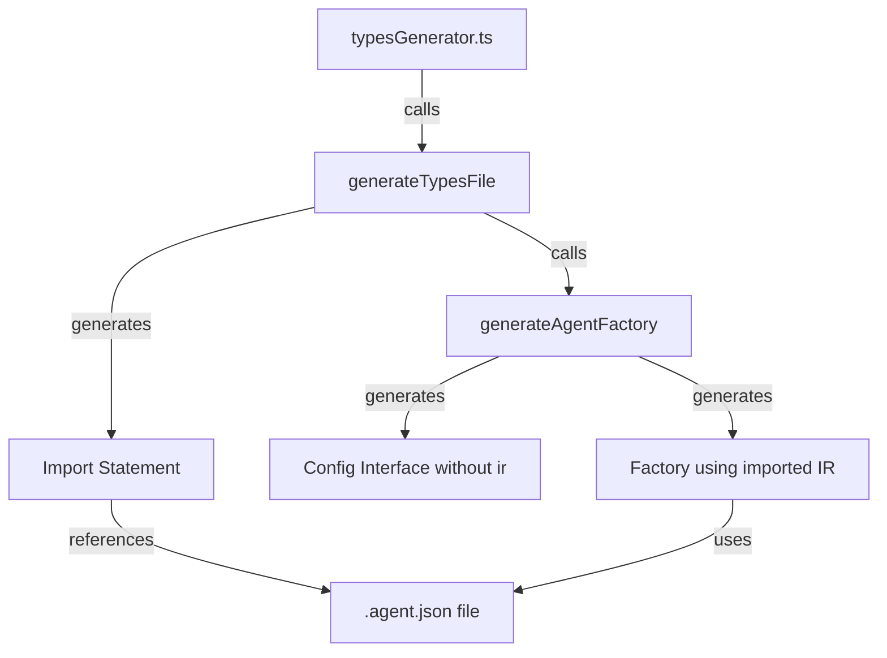

# Design Document: IR Auto-Import

## Overview

This design specifies modifications to the Auwgent types generator to automatically embed IR imports in generated TypeScript files. The change eliminates the need for users to manually import IR JSON files when creating agents, improving developer experience by reducing boilerplate and potential errors.

The implementation involves two key changes:
1. Adding an import statement at the top of generated `.agent.types.ts` files
2. Removing the `ir` property from the factory configuration interface and using the imported IR internally

## Architecture

### Current Flow

```
.agent file → Compiler → .agent.json (IR) + .agent.types.ts (types)
                                ↓
                         User imports both files
                                ↓
                         createAgent({ ir: agentIR, ... })
```

### New Flow

```
.agent file → Compiler → .agent.json (IR) + .agent.types.ts (types with embedded import)
                                                ↓
                                         User imports types only
                                                ↓
                                         createAgent({ ... })
```

### Component Interaction



## Components and Interfaces

### Modified Component: `generateTypesFile()`

**Current Behavior:**
- Generates import statements for runtime dependencies
- Does not import the IR JSON file
- Delegates to `generateAgentFactory()` for factory generation

**New Behavior:**
- Generates import statement for the IR JSON file after runtime imports
- Casts imported JSON to `AgentIR` type
- Passes imported IR reference to factory generation logic

**Implementation:**

```typescript
export function generateTypesFile(agent: AgentIR): string {
    const workflowTools = collectWorkflowTools(agent);
    const allTools = mergeToolDefs(agent.tools ?? [], workflowTools);
    const hasTools = allTools.length > 0;
    const hasContext = agent.context && Object.keys(agent.context).length > 0;
    const hasLifecycle = agent.lifecycle?.enabled === true;
    const requiredProviders = collectRequiredProviders(agent);
    const transferredHelpers = collectTransferredHelpers(agent);

    // Generate IR import statement
    const irImportStatement = `import agentIR from './${agent.name}.agent.json' assert { type: 'json' };`;

    const sections = [
        `// Auto-generated types for ${agent.name}`,
        `// Do not edit manually`,
        ``,
        `// Core Runtime Imports`,
        `import { Agent, RunConfig } from "../javascript/loader/IrInterpreter";`,
        requiredProviders.has("gemini") ? `import { GoogleDriver } from "../javascript/loader/drivers/GoogleDriver";` : '',
        requiredProviders.has("openai") || requiredProviders.has("custom") ? `import { OpenAIDriver } from "../javascript/loader/drivers/OpenAIDriver";` : '',
        `import type { AgentIR } from "../javascript/loader/types/ir";`,
        `import type { SyntheticMessage, ConversationState, LifecycleHooks } from "../javascript/loader/types/protocol";`,
        ``,
        irImportStatement,  // Add IR import here
        ``,
        // ... rest of generation remains the same
        agent.types ? generateCustomTypes(agent.types) : '',
        generateInputInterface(agent),
        ...transferredHelpers.map(helper => generateHelperOutputInterface(helper)),
        generateOutputInterface(agent, transferredHelpers),
        generateContextInterface(agent),
        hasTools ? generateToolsInterface(agent.name, allTools) : '',
        hasLifecycle ? generateLifecycleInterface(agent, hasContext ?? false) : '',
        requiredProviders.size > 0 ? generateApiKeysInterface(agent, requiredProviders) : '',
        generateAgentFactory(agent, hasTools, hasContext ?? false, hasLifecycle, requiredProviders, transferredHelpers),
    ];

    return sections.filter(Boolean).join('\n');
}
```

**Import Statement Format:**

The import uses JSON import assertions (TypeScript 4.5+):
```typescript
import agentIR from './agentName.agent.json' assert { type: 'json' };
```

This requires:
- TypeScript compiler option `resolveJsonModule: true`
- TypeScript compiler option `esModuleInterop: true`
- The JSON file must be in the same directory as the types file

### Modified Component: `generateAgentFactory()`

**Current Behavior:**
- Generates `Config` interface with `ir: AgentIR` property
- Factory function expects `config.ir` parameter
- Calls `agent.load(config.ir)` with user-provided IR

**New Behavior:**
- Generates `Config` interface WITHOUT `ir` property
- Factory function uses imported `agentIR` constant
- Calls `agent.load(agentIR)` with automatically imported IR

**Implementation Changes:**

```typescript
function generateAgentFactory(
    agent: AgentIR, 
    hasTools: boolean, 
    hasContext: boolean, 
    hasLifecycle: boolean, 
    requiredProviders: Set<string>, 
    transferredHelpers: HelperType[]
): string {
    // ... existing setup code ...

    // Build config interface properties (REMOVE ir property)
    const configProps: string[] = [];
    if (hasApiKeys) {
        configProps.push(`    apiKeys: ${agent.name}ApiKeys;`);
    }
    // REMOVED: configProps.push(`    ir: AgentIR;`);
    if (hasContext) {
        configProps.push(`    context?: ${agent.name}Context;`);
    }
    if (hasTools) {
        configProps.push(`    tools?: ${agent.name}Tools;`);
    }
    if (hasLifecycle) {
        configProps.push(`    lifecycle?: ${agent.name}Lifecycle;`);
    }

    // ... existing validation code ...

    // Update validation checks to use agentIR instead of config.ir
    const validationChecks: string[] = [];
    
    if (hasTools) {
        validationChecks.push(`
    // Validate tools against IR
    const toolMap = new Map<string, any>();
    if (agentIR.tools && agentIR.tools.length > 0) {
        for (const toolDef of agentIR.tools) {
            toolMap.set(toolDef.name, toolDef);
        }
    }
    if (agentIR.workflows && agentIR.workflows.length > 0) {
        for (const workflow of agentIR.workflows) {
            if (workflow.tools && workflow.tools.length > 0) {
                for (const toolDef of workflow.tools) {
                    toolMap.set(toolDef.name, toolDef);
                }
            }
        }
    }
    for (const toolDef of toolMap.values()) {
        if (!config.tools?.[toolDef.name]) {
            throw new Error(
                \`Missing required tool: \${toolDef.name}\\n\` +
                \`Expected in tools configuration\`
            );
        }
    }`);
    }

    if (hasLifecycle) {
        validationChecks.push(`
    // Validate lifecycle hooks if required
    if (agentIR.lifecycle?.enabled && !config.lifecycle) {
        throw new Error(
            \`Agent "\${agentIR.name}" requires lifecycle hooks.\\n\` +
            \`Provide: { prune, load, save }\`
        );
    }`);
    }

    return `
/**
 * Configuration for ${agent.name} agent
 */
export interface ${agent.name}Config {
${configProps.join('\n')}
}

/**
 * Create a type-safe ${agent.name} agent instance
 * 
 * @example
 * \`\`\`typescript
 * const agent = create${agent.name}({
 *     apiKeys: { geminiApiKey: '...' },${hasContext ? '\n *     context: { sessionId: "123" },' : ''}${hasTools ? '\n *     tools: { ... },' : ''}${hasLifecycle ? '\n *     lifecycle: { prune, load, save }' : ''}
 * });
 * 
 * const result = await agent.run({ ... });
 * \`\`\`
 */
export function create${agent.name}(config: ${agent.name}Config) {
    // Create agent with drivers
    const agent = new Agent<${typeParams}>(${driversObject});
    
    // Load and validate IR from imported file
    agent.load(agentIR);
${validationChecks.join('\n')}
    
    return {
        // ... rest of factory implementation remains the same
    };
}
`;
}
```

## Data Models

### Input: AgentIR

The `AgentIR` interface remains unchanged. It represents the compiled intermediate representation of an agent definition.

### Output: Generated TypeScript File

**Before:**
```typescript
// Auto-generated types for MyAgent
// Do not edit manually

// Core Runtime Imports
import { Agent, RunConfig } from "../javascript/loader/IrInterpreter";
import type { AgentIR } from "../javascript/loader/types/ir";

export interface MyAgentConfig {
    apiKeys: MyAgentApiKeys;
    ir: AgentIR;  // User must provide this
    tools?: MyAgentTools;
}

export function createMyAgent(config: MyAgentConfig) {
    const agent = new Agent(...);
    agent.load(config.ir);  // Uses user-provided IR
    // ...
}
```

**After:**
```typescript
// Auto-generated types for MyAgent
// Do not edit manually

// Core Runtime Imports
import { Agent, RunConfig } from "../javascript/loader/IrInterpreter";
import type { AgentIR } from "../javascript/loader/types/ir";

import agentIR from './MyAgent.agent.json' assert { type: 'json' };

export interface MyAgentConfig {
    apiKeys: MyAgentApiKeys;
    // ir property removed
    tools?: MyAgentTools;
}

export function createMyAgent(config: MyAgentConfig) {
    const agent = new Agent(...);
    agent.load(agentIR);  // Uses imported IR
    // ...
}
```

### Path Resolution

The import path is constructed as:
```typescript
const irImportStatement = `import agentIR from './${agent.name}.agent.json' assert { type: 'json' };`;
```

This assumes:
- The `.agent.json` file has the same base name as the agent
- Both files are in the same directory
- The relative path `./` references the current directory

## Error Handling

### TypeScript Compilation Errors

**Error:** `Cannot find module './MyAgent.agent.json'`

**Cause:** The JSON file doesn't exist or is in a different location

**Resolution:** Ensure the compiler generates both files in the same directory

---

**Error:** `Module './MyAgent.agent.json' was resolved to a type-only declaration`

**Cause:** `resolveJsonModule` is not enabled in `tsconfig.json`

**Resolution:** Add to `tsconfig.json`:
```json
{
  "compilerOptions": {
    "resolveJsonModule": true,
    "esModuleInterop": true
  }
}
```

### Runtime Errors

**Error:** `Missing required tool: toolName`

**Cause:** User didn't provide required tools in config

**Resolution:** This validation remains unchanged - the error message guides users to provide the missing tool

---

**Error:** `Agent "AgentName" requires lifecycle hooks`

**Cause:** Agent has lifecycle enabled but user didn't provide hooks

**Resolution:** This validation remains unchanged - the error message guides users to provide lifecycle hooks

### Build System Considerations

**JSON File Not Copied:**

If the build system doesn't copy `.agent.json` files to the output directory, the import will fail at runtime.

**Resolution:** Ensure build configuration (webpack, vite, etc.) includes JSON files in the output.

## Testing Strategy

### Unit Tests

Unit tests will verify specific examples and edge cases:

1. **Import Statement Generation**
   - Test that `generateTypesFile()` includes the correct import statement
   - Test that the import path uses the agent name correctly
   - Test that the import uses JSON assertion syntax

2. **Config Interface Generation**
   - Test that the generated config interface does NOT include `ir` property
   - Test that other properties (apiKeys, tools, context, lifecycle) are still present
   - Test with agents that have different combinations of features

3. **Factory Function Generation**
   - Test that the factory uses `agentIR` instead of `config.ir`
   - Test that validation logic references `agentIR` instead of `config.ir`
   - Test that the generated code is syntactically valid TypeScript

4. **Edge Cases**
   - Test with agent names containing special characters
   - Test with minimal agents (no tools, no context, no lifecycle)
   - Test with maximal agents (all features enabled)

### Property-Based Tests

Property-based tests will verify universal properties across all inputs. Each test will run a minimum of 100 iterations with randomized inputs.

## Correctness Properties

*A property is a characteristic or behavior that should hold true across all valid executions of a system—essentially, a formal statement about what the system should do. Properties serve as the bridge between human-readable specifications and machine-verifiable correctness guarantees.*

### Property 1: Import Statement Generation

*For any* valid AgentIR object, when `generateTypesFile()` is called, the generated output SHALL contain an import statement that:
- Appears after the runtime imports section
- Uses the format `import agentIR from './{agentName}.agent.json' assert { type: 'json' };`
- References the agent's name in the file path
- Uses valid TypeScript JSON import assertion syntax

**Validates: Requirements 1.1, 1.2, 1.3, 1.4, 3.1**

### Property 2: Config Interface Excludes IR Property

*For any* valid AgentIR object, when `generateTypesFile()` is called, the generated `{AgentName}Config` interface SHALL NOT contain an `ir` property, and the generated factory function SHALL reference `agentIR` (the imported constant) instead of `config.ir` in all locations.

**Validates: Requirements 2.1, 2.2**

### Property 3: Validation Logic Preservation

*For any* valid AgentIR object with tools or lifecycle enabled, when `generateTypesFile()` is called, the generated factory function SHALL contain validation logic that:
- Checks for required tools by referencing `agentIR.tools` and `agentIR.workflows`
- Checks for lifecycle hooks by referencing `agentIR.lifecycle`
- Throws appropriate errors when validation fails
- Does NOT reference `config.ir` anywhere

**Validates: Requirements 2.3, 4.2**

### Property 4: Backward Compatibility Across Agent Configurations

*For any* valid AgentIR object (regardless of whether it has tools, context, lifecycle, or any combination thereof), when `generateTypesFile()` is called, the generated TypeScript code SHALL:
- Be syntactically valid
- Include all non-IR config properties (apiKeys, tools, context, lifecycle) when applicable
- Generate a factory function that accepts the correct config interface
- Load the IR using `agent.load(agentIR)`

**Validates: Requirements 2.4, 4.1**

### Property 5: Generated Code Compilation

*For any* valid AgentIR object, when the generated TypeScript file is compiled with `resolveJsonModule: true` and the corresponding `.agent.json` file exists in the same directory, the TypeScript compiler SHALL successfully compile the file without errors.

**Validates: Requirements 3.2**


## Testing Strategy

### Dual Testing Approach

This feature will use both unit tests and property-based tests to ensure comprehensive coverage:

- **Unit tests** will verify specific examples, edge cases, and integration points
- **Property tests** will verify universal properties across randomized inputs

Together, these approaches provide comprehensive coverage where unit tests catch concrete bugs and property tests verify general correctness.

### Unit Testing

Unit tests will focus on:

1. **Specific Examples**
   - Test generation for a minimal agent (no tools, no context, no lifecycle)
   - Test generation for a maximal agent (all features enabled)
   - Test generation for an agent with only tools
   - Test generation for an agent with only context
   - Test generation for an agent with only lifecycle

2. **Edge Cases**
   - Agent names with hyphens (e.g., "my-agent")
   - Agent names with underscores (e.g., "my_agent")
   - Agent names with numbers (e.g., "agent123")
   - Agents with empty tool lists
   - Agents with multiple workflows containing tools

3. **Integration Points**
   - Verify the import statement is placed in the correct location (after runtime imports)
   - Verify the config interface is generated correctly
   - Verify the factory function signature matches the config interface
   - Verify validation error messages are preserved

### Property-Based Testing

Property-based tests will verify universal properties using a PBT library for TypeScript (such as `fast-check`). Each property test will run a minimum of 100 iterations with randomized inputs.

**Test Configuration:**
- Library: `fast-check` (for TypeScript/JavaScript)
- Iterations: 100 minimum per property
- Each test will be tagged with: **Feature: ir-auto-import, Property {number}: {property_text}**

**Property Test Implementation:**

1. **Property 1: Import Statement Generation**
   - Generate random AgentIR objects with varying names
   - Call `generateTypesFile()`
   - Verify output contains import statement with correct format
   - Tag: **Feature: ir-auto-import, Property 1: Import Statement Generation**

2. **Property 2: Config Interface Excludes IR Property**
   - Generate random AgentIR objects
   - Call `generateTypesFile()`
   - Parse generated TypeScript to extract config interface
   - Verify `ir` property is NOT present
   - Verify factory references `agentIR` not `config.ir`
   - Tag: **Feature: ir-auto-import, Property 2: Config Interface Excludes IR Property**

3. **Property 3: Validation Logic Preservation**
   - Generate random AgentIR objects with tools and/or lifecycle
   - Call `generateTypesFile()`
   - Verify validation code references `agentIR.tools`, `agentIR.workflows`, `agentIR.lifecycle`
   - Verify validation code does NOT reference `config.ir`
   - Tag: **Feature: ir-auto-import, Property 3: Validation Logic Preservation**

4. **Property 4: Backward Compatibility Across Agent Configurations**
   - Generate random AgentIR objects with various feature combinations
   - Call `generateTypesFile()`
   - Verify generated code is syntactically valid TypeScript
   - Verify all expected config properties are present
   - Verify factory loads IR using `agent.load(agentIR)`
   - Tag: **Feature: ir-auto-import, Property 4: Backward Compatibility Across Agent Configurations**

5. **Property 5: Generated Code Compilation**
   - Generate random AgentIR objects
   - Write generated TypeScript and JSON files to temporary directory
   - Run TypeScript compiler with `resolveJsonModule: true`
   - Verify compilation succeeds without errors
   - Tag: **Feature: ir-auto-import, Property 5: Generated Code Compilation**

### Test Data Generation

For property-based tests, we'll need generators for:

- **Agent names**: Random strings with alphanumeric characters, hyphens, underscores
- **Tool definitions**: Random tool names, parameters, return types
- **Context objects**: Random property names and types
- **Lifecycle configurations**: Random enabled/disabled states with max tokens/messages
- **Model configurations**: Random provider types (gemini, openai, custom)

### Manual Testing

After implementation, manually test:

1. Generate a real agent with the modified generator
2. Verify the generated `.agent.types.ts` file contains the import
3. Write a test application that uses the generated factory
4. Verify the application compiles and runs correctly
5. Verify the agent functions as expected without manual IR import
